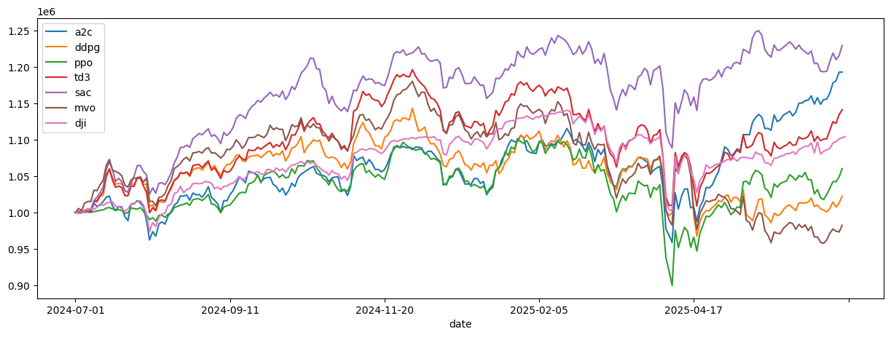
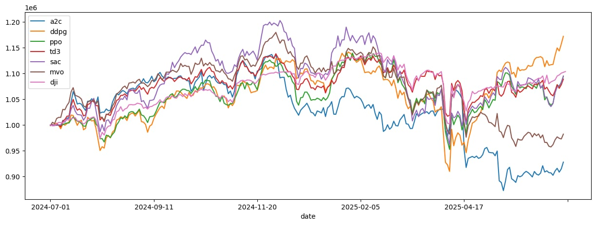
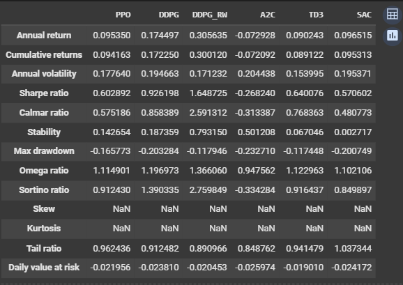

# 📈 Automated Stock Trading with FinRL

This project implements **Reinforcement Learning (RL)** for automated stock trading using the **FinRL framework**.  
The goal is to train an RL agent on historical stock market data and evaluate its performance using financial metrics.  

---

## 🚀 Project Structure
- `notebooks/`
  - **01_data_preparation.ipynb** → Load and clean historical stock data.
  - **02_drl_training.ipynb** → Create trading environment with FinRL and Train RL agent (e.g., DDPG, PPO, A2C).
  - **03_drl_backtest.ipynb** → Evaluate performance, visualize results.
  - **04_drl_training_rolling_window.ipynb** → Train the DDPG agent using the rolling window technique and analyze its potential impact on performance(Return vs. Risk).
- `results/`
  - Final plots (cumulative returns,performance metrics).
- `requirements.txt` → Dependencies.

---
## 📊 Results
The project evaluates multiple reinforcement learning agents compared to baseline strategies.  

### 🔹 1. Cumulative Returns (5 Agents vs. Baselines)
  
Performance comparison of **5 RL agents** against baseline strategies (**MVO** and **DJI Index**).  

---

### 🔹 2. Rolling Window Training (DDPG vs. Others)
  
When applying a **rolling window training strategy**, the **DDPG agent** significantly **outperforms all other agents** and baselines, showing improved adaptability to market changes.  

---

### 🔹 3. Performance Metrics
  
Comparison of metrics for **6 RL agents** and the baselines (**MVO** and **DJI Index**).  
## ⚙️ Tech Stack
- Python 🐍
- FinRL
- Stable Baselines3
- Pandas, NumPy, Matplotlib

---

## 🔧 Installation & Usage
Clone this repository and install dependencies:

```bash
git clone https://github.com/mazen-tmani/stock-trading-finRL.git
cd stock-trading-finRL
pip install -r requirements.txt
